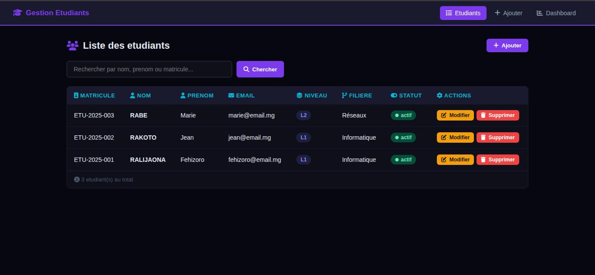

# Gestion Etudiants

Application web de gestion des etudiants en PHP pur + MySQL.

## Aperçue


## Technologies
- PHP 8.1
- MySQL (PDO)
- Font Awesome 6
- Apache

## Fonctionnalites
- Lister tous les etudiants avec recherche
- Ajouter un etudiant
- Modifier un etudiant
- Supprimer un etudiant
- Dashboard avec statistiques par niveau

## Installation

### 1. Cloner le projet
```bash
git clone https://github.com/tonusername/gestion-etudiants
cd gestion-etudiants
```

### 2. Créer la base de données
```sql
CREATE DATABASE gestion_etudiants;
USE gestion_etudiants;

CREATE TABLE etudiants (
    id INT AUTO_INCREMENT PRIMARY KEY,
    matricule VARCHAR(20) UNIQUE NOT NULL,
    nom VARCHAR(100) NOT NULL,
    prenom VARCHAR(100) NOT NULL,
    email VARCHAR(150) UNIQUE,
    telephone VARCHAR(20),
    niveau ENUM('L1','L2','L3','M1','M2') DEFAULT 'L1',
    filiere VARCHAR(100),
    date_inscription DATE DEFAULT (CURDATE()),
    statut ENUM('actif','inactif') DEFAULT 'actif'
);
```

### 3. Configurer la connexion
Crée un fichier `config.php` basé sur `config.example.php` :
```bash
cp config.example.php config.php
```
Modifie les identifiants dans `config.php`.

### 4. Déployer dans Apache
```bash
sudo cp -r . /var/www/html/gestion-etudiants
```

Accède à : `http://localhost/gestion-etudiants`

## Sécurité
- Connexion via utilisateur MySQL dédié (pas root)
- Requêtes préparées PDO contre les injections SQL
- `config.php` exclu du repo via `.gitignore`

## Auteur
Fehizoro RALIJAONA